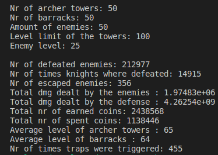
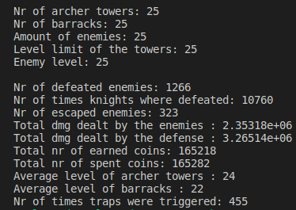
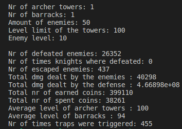

# OOP_Lab_5
## Simulation
This is a simulation of a tower defense game.
Because it is a continuos simulation, the game will not end when there are no more enemies left or when the player loses all hit points.
Instead, it will count multiple stats over a period of time and at the end it will display the statistics, like how many enemies have been defeated, how many of them managed to go past your defenses, how many of your knights were defeated by enemies, how much dmg has been dealt in total by the enemies and the defense, how many coins were earned and spent etc.

The parameters that allow the simulation to run differently each time are: game difficuty/enemy level, number of enemies, number of towers and level limit of the towers. 

## Functionality
The basic way that the simualtion works is that enemies spawn on the left side of the map and slowly move to the right until they reach the edge or are defeated by the players defenses.
* Enemies:
    * An enemy can only move a set amount of tiles determined by it's movement speed, once per turn, unless they are in combat with a melee unit from the barracks. 
    * If an enemy reaches the edge of the map, it will be reset. 
    * Once an enemy is defeated it can not be targeted by any tower.
    * Once in combat, the enemy will attack once per turn.
    * If an enemy dies, the player receives gold based on the enemy's level.
* Archer tower
    * Can have up to 3 archers.
    * Increases the archers' range.
* Archers
    * Archers  are stationed in a archer tower and each one has it's own range based on the weapon's stats.
    * If an enemy is in their range, the archer will shoot them and either hit or miss the shot based on their stats.
    * Once the archer has shot once, it can not shoot again in the same turn.
* Barracks
    * Can have up to 3 knights.
    * Checks if there is an enemy in its range and if yes sends a knight to fight with it.
    * A knight can only hit an enemy once per turn and he will either hit or miss the enemy based on his stats.
    * Once a knight reaches 0 health he cannot enter combat and instaed will start healing for a set amount every turn and won't be able to enter combat until he fully heals.
* Weapons
    * Every time a unit uses their weapon, the weapon's integrity will be reduced by a small amount.
    * Integrity affects how much dmg the weapon does (max is 100%).
    * Once a weapon reaches less that a certain amount of integrity, the unit carrying the weapon will repair it. 
* Traps
    * When an enemy steps on a trap, it deals massive dmg to them.
    * Once a trap is triggered, it enters a cooldown and it cannot be deployed until the cooldown is over.
* Quarry
    * Passively generates gold for the player.

## Examples

